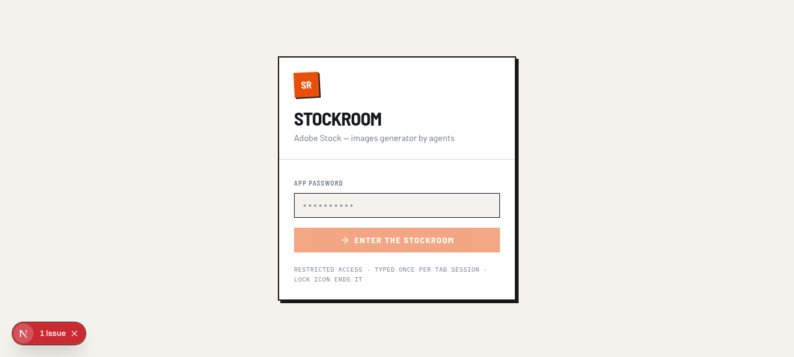
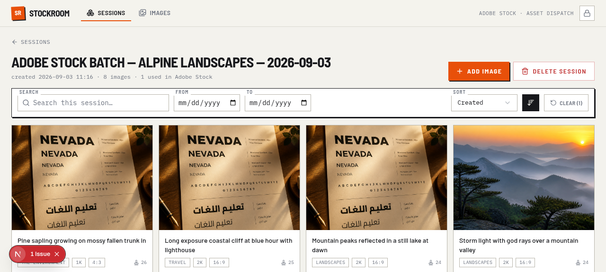
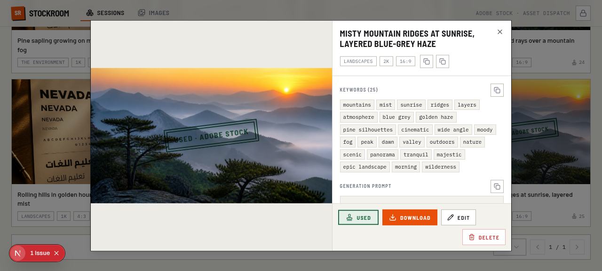
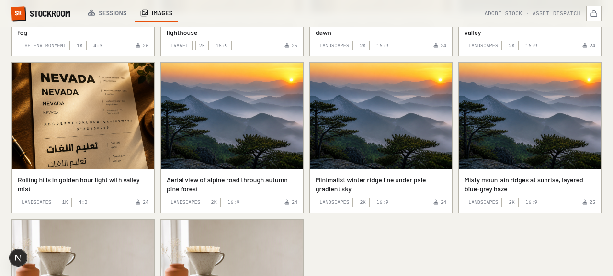

# ── Stock Room ──

**Stock Room** est le hub de dispatch des images générées par IA : un **agent IA** reçoit une
mission (batch stock multi-plateformes, coloring book Etsy, visuels d'événement Instagram,
scènes d'une vidéo, créations publicitaires…), génère les images via l'API
[Zazo Image Studio](https://github.com/mimo-xman/webapp--zazo-image-studio),
et enregistre chaque asset dans une base de données, **une Session par mission** — les
**images vendables une par une** (`images_to_bay`, avec leurs métadonnées d'upload par
plateforme) et les **produits digitaux Etsy** (`etsy_products`, plusieurs images derrière
une seule fiche). Le propriétaire gère ensuite le tout depuis une webapp protégée par mot
de passe.

> Historique : le projet s'appelait *Adobe Stock — Images Generator by agents* car la
> première mission était la production d'images pour Adobe Stock. Le nom a changé quand les
> missions se sont multipliées : Stock Room vend aujourd'hui la même image sur **8
> marketplaces** (Adobe Stock, Shutterstock, Wirestock, iStock/Getty, Pond5,
> Depositphotos, 123RF, Dreamstime) — chaque plateforme a ses propres métadonnées,
> stockées **par image, pour chaque plateforme**. Les repos GitHub sont renommés
> (`webapp--stock-room` et `webapp--zazo-image-studio`) — les anciennes URLs redirigent
> automatiquement.

```
┌─────────────┐   1. agent prompt (mission)    ┌──────────────┐
│  AI Agent   │ ────────────────────────────► │  Toi (owner) │  tu colles le prompt rempli
└──────┬──────┘                               └──────────────┘
       │ 2. recherche web (règles + demande de la plateforme cible)
       │ 3. POST /generate
       ▼
┌──────────────────┐  image URL   ┌─────────────────────────────────┐
│ Zazo Image Studio│ ───────────► │  Stock Room API  (Render)       │
│  (Render, Tor)   │              │  images_to_bay + etsy_products │
│                  │              │  + sessions  (MongoDB)         │
└──────────────────┘              └───────────────┬─────────────────┘
                                                  │ 4. lecture/édition
                                                  ▼
                                        ┌──────────────────┐
                                        │ WebApp (Cloudflare│  mot de passe (APP_PASSWORD)
                                        │ Workers + Netlify)│  pagination/filtres backend
                                        └──────────────────┘

                                        ┌─────────────────────────────────┐
                                        │  GitHub Actions (quotidien 08:00 │
                                        │  Maroc) — Real-ESRGAN upscales  │
                                        │  → Cloudinary → upscales[]       │
                                        └─────────────────────────────────┘
```

## Les missions = des agent prompts

Chaque type de mission a son prompt prêt à envoyer, dans [`prompts/`](prompts/) (l'index
détaillé est dans [`AGENT_PROMPT.md`](AGENT_PROMPT.md)) :

| Prompt | Mission | Variable spécifique |
|---|---|---|
| [`prompts/main.md`](prompts/main.md) | **Universel** — explique les deux APIs + les structures images / produits Etsy ; tu décris la mission (n'importe quoi : visuels Instagram, scènes vidéo, pubs…) | `[MISSION BRIEF]` |
| [`prompts/stock-platforms.md`](prompts/stock-platforms.md) | Batch stock **multi-plateformes** (Adobe Stock, Shutterstock, Wirestock, iStock/Getty, Pond5, Depositphotos, 123RF, Dreamstime) — recherche de règles + **politique IA par plateforme** en live, **recherche de saturation sur les marketplaces**, règles dures (aucun être vivant, aucun visage/partie du corps), **profils de différenciation par image**, **métadonnées d'upload par plateforme** stockées sur chaque image (title/description/categories/keywords aux formats et limites de chacune) | `[NUMBER OF PROMPTS TO CREATE]` |
| [`prompts/coloring-book-etsy.md`](prompts/coloring-book-etsy.md) | **Coloring book Etsy** — pages line-art pour enfants + couverture + **images d'annonce** (les photos de fiche qui vendent le livre — règle dure dédiée à leur qualité, ≥ 4 par livre, `role: "marketing"`, **générées en mode image-to-image AVEC la vraie couverture et les vraies pages en images de référence — le client voit exactement le livre qu'il achète**), print-ready ; **boucle de contrôle qualité par image (STEP 4c) : checklist de défauts de design + régénération avec prompt corrigé, 3 essais max puis redesign** ; l'agent **recherche lui-même le thème tendance le plus demandé** sur Etsy et le choisit **SANS êtres vivants** (règles de contenu du propriétaire — véhicules, machines, bâtiments, jouets, plantes, motifs…) ; le livre est sauvé comme **UN produit Etsy** (couverture + pages + images promo + métadonnées complètes de fiche : title ≤ 140, 13 tags ≤ 20 caractères, catégorie, prix) | `[NUMBER OF COLORING PAGES]` |
| [`prompts/activity-book-etsy.md`](prompts/activity-book-etsy.md) | **Activity book Etsy** — pages d'activités line-art pour enfants (**≥ 4 types d'activités mélangés** : labyrinthes, points à relier, tracés, associations, comptages… **puzzles solvables à solution unique** + texte fonctionnel correct) + couverture + images d'annonce i2i ; boucle QC STEP 4c ; thème NON-VIVANT recherché par l'agent | `[NUMBER OF ACTIVITY PAGES]` |
| [`prompts/party-invitations-etsy.md`](prompts/party-invitations-etsy.md) | **Party invitations Etsy** — set cohérent d'invitations 5×7 à remplir (headline + lignes nommées, **orthographe parfaite exigée**) + images d'annonce i2i (fan du set, close-up, scène de fête) ; occasion + thème recherchés par l'agent, **décorations SANS êtres vivants** (ballons, fusées, fleurs…) | `[NUMBER OF INVITATION DESIGNS]` |
| [`prompts/wall-art-set-etsy.md`](prompts/wall-art-set-etsy.md) | **Wall art set Etsy** — set de prints assortis UNE palette / UNE ratio / un style (qualité galerie, zéro artefact/banding ; quotes autorisées si parfaitement orthographiées) + annonces i2i (frames stylisés, mockup gallery wall avec les VRAIS prints) ; style + thème recherchés par l'agent, NON-VIVANT | `[NUMBER OF ART PRINTS]` |
| [`prompts/printable-set-etsy.md`](prompts/printable-set-etsy.md) | **Printable set Etsy** — système imprimable fonctionnel (chore charts, planners, trackers, bingo, gift tags…) : pages coordonnées **utilisables** (sections alignées, cases réelles, espace d'écriture), texte = produit (zéro faute) + annonces i2i ; niche recherchée par l'agent, accents NON-VIVANTS | `[NUMBER OF PRINTABLE PAGES]` |
| [`prompts/clipart-bundle-etsy.md`](prompts/clipart-bundle-etsy.md) | **Clipart bundle Etsy** — bundle d'éléments PNG individuels **isolés sur blanc pur** (1 sujet/image, silhouette fermée — le propriétaire détourne en post), UN style/palette pour tout le bundle, usage commercial + annonces i2i (sample sheets avec les VRAIS éléments) ; thème + style recherchés par l'agent, NON-VIVANT | `[NUMBER OF CLIPART ELEMENTS]` |
| [`prompts/digital-download-etsy.md`](prompts/digital-download-etsy.md) | **Digital download Etsy (générique)** — l'agent recherche quel produit digital se vend MAINTENANT, choisit le produit ET son `product_type` (templates, jeux, ressources éducatives, cartes, sets saisonniers… y compris coloring/activity/invitations/wall art/printable/clipart) et applique les conventions du type ; couvre les types `digital_download` et `other` du filtre /etsy | `[NUMBER OF PRODUCT IMAGES]` |

### Les règles de contenu du propriétaire — dans tous les prompts, présents et futurs

Interdit de générer des images contenant des **êtres vivants** (humains, animaux), des
**visages** (yeux, oreilles, bouche… même sur des objets) ou des **membres** (pieds, mains,
bras… même isolés). Plantes, fleurs et arbres autorisés. Le texte canonique vit dans
[`prompts/_global-content-rules.md`](prompts/_global-content-rules.md) ; il est intégré
dans chaque prompt (l'agent l'applique pendant sa recherche internet, dans chaque prompt de
génération, et au contrôle visuel), `scripts/gen-prompt-template.py` **refuse** de générer un
prompt sans ces règles, et la webapp les réinjecte automatiquement si un template les perd.

### Les règles de distinctivité (anti-rejet « similar content ») — dans tous les prompts, présents et futurs

Adobe Stock **refuse** le contenu trop proche de ce qui existe déjà (« closely resembles
content already available ») — c'est LE motif de rejet qui gaspillait le quota et l'énergie.
Le remède définitif vit dans
[`prompts/_global-distinctiveness-rules.md`](prompts/_global-distinctiveness-rules.md) et
suit la même architecture que les règles de contenu : intégré dans **chaque** prompt,
vérifié au build (`CLEARLY DIFFERENTIATED`), réinjecté par la webapp si un template le perd.
L'agent doit :

- différencier chaque image **deux fois** — du catalogue existant de la plateforme ET des
  autres images du même batch (sur ≥ 2 des 4 axes que les modérateurs vérifient :
  composition, couleur, ambiance, scénario) ;
- **jamais la depiction par défaut** (le « rendu moyen » que le modèle produit avec un prompt
générique — c'est exactement le look déjà présent des milliers de fois) ;
- **vérifier la saturation avant de s'engager** sur un sujet : chercher le sujet sur
  stock.adobe.com / etsy.com, lire le nombre de résultats et la première page ;
- **vérifier la distinctivité avant de sauvegarder** : une image générique ou jumelle d'une
  autre image du run est rejetée et régénérée, exactement comme une violation des règles de
  contenu ;
- **sélectif plutôt que volumineux** : N images = N concepts distincts, jamais un concept
décliné N fois.

La webapp (page **Agent prompts**) remplie, valide et exporte ces prompts — les six variables
de connexion (les 2 URLs + 2 clés + 2 repos) sont partagées entre tous les prompts et
sauvegardées une fois pour toutes dans le navigateur. Ajouter un 4ᵉ prompt = un fichier
`.md` dans `prompts/` (avec **les deux blocs de règles** — contenu + distinctivité — le build
les vérifie) + une entrée dans `web/src/lib/prompts.ts`.

## Aperçu de la webapp

| | |
|---|---|
|  |  |
| *Porte d'entrée (mot de passe)* | *Session — grille d'images réelles* |
|  |  |
| *Détail : métadonnées + tampon + copy icons* | *Toutes les images : filtres, tri, pagination* |

## Structure du repo

| Chemin | Contenu | Hébergement |
|---|---|---|
| `api/` | API Node.js + Express + Mongoose (**images_to_bay** avec métadonnées par plateforme + flags `used` par plateforme, **etsy_products** : produits digitaux multi-images — livrable (cover/page/asset/preview) **+ images d'annonce (`role: "marketing"`)** + métadonnées de fiche Etsy + **gestion par image** (PATCH/DELETE par image, claim/release atomiques pour les workers d'upscale), Sessions, auth double, validation zod par plateforme, rate limit, pagination/search/filter/sort backend, proxy download, cascade delete, **upscales** : endpoints + filtres + cap serveur, **`GET /api/images/all`** : toute la librairie en un appel pour l'anti-doublons de l'agent, **`api/scripts/migrate-to-multiplatform.cjs`** : migration de l'ancien schéma plat (génère les `_id` des images), **`api/scripts/backfill-etsy-image-ids.cjs`** : répare les `_id` manquants des produits migrés) | **Render** (runtime Node) |
| `web/` | WebApp Next.js 16 (password gate, pages Sessions/Images/**Etsy** avec **détail de session affichant les DEUX : images + produits Etsy**, badges « N img · N Etsy products · N used », **boutons Add image / Add Etsy product**, popups de détail **spécifiques par type** (popup image pour les images à vendre, popup produit image-par-image avec métadonnées à droite + bascule original/upscales pour les produits), **formulaire complet d'édition des produits Etsy** (métadonnées + gestion des images : rôle, caption, suppression, ajout), tampons « Used » par plateforme, copy icons, modales custom, **navigation prev/next en boucle dans le détail**, **affichage des upscales**, **export CSV multi-plateformes avec sélecteur de plateforme** (Adobe Stock, Shutterstock, Dreamstime, 123RF, Pond5 — formats officiels ; iStock/Wirestock/Depositphotos = coming soon), **cartes de métadonnées par plateforme dans le détail + onglets par plateforme dans le formulaire**, **statut batch**, **page « Agent prompts »** : switcher multi-prompts + variables partagées + validation → prompt généré copiable/téléchargeable en .md, **sélection en masse Select all / Deselect all par catégories** (origin/x2/x4, aucune case cochée par défaut, s'accumule page après page) + **tampon « Mark N as used » en un clic** (une seule requête API), **ZIP produit Etsy complet** (popup origin/×2/×4/metadata, construit et streamé côté API + `metadata.txt`), **jeu d'icônes complet** : `icon.svg` + `apple-icon.png` + `favicon.ico` « SR ») | **Cloudflare Workers** (ou Netlify) |
| `prompts/` | **Les prompts réutilisables** à donner à l'agent — un `.md` par type de mission (variables à remplacer + partie sous la ligne ✂ CUT) | — |
| `AGENT_PROMPT.md` | Index des prompts + mode d'emploi | — |
| `.github/workflows/` | **Jobs d'upscale Real-ESRGAN** : batch quotidien 08:00 Maroc (images à vendre) + **batch quotidien 10:00 Maroc des images de produits Etsy (cover, pages ET images d'annonce)** + job manuel image unique (réveil auto de l'API Render, logs heartbeat, sortie JPEG prête à vendre) | **GitHub Actions** |
| `scripts/upscale/` | Scripts Python partagés des jobs (API client, Cloudinary, Real-ESRGAN) | — |
| `scripts/gen-prompt-template.py` | Régénère les fallbacks bundlés de la page « Agent prompts » (`web/src/lib/prompt-templates/`) depuis `prompts/*.md` — à lancer après chaque édition d'un prompt | — |

## Déploiement

### 1. Base de données — MongoDB Atlas (gratuit)

1. Crée un cluster M0 sur [mongodb.com/atlas](https://www.mongodb.com/atlas).
2. Database Access : un utilisateur + mot de passe.
3. Network Access : `0.0.0.0/0` (Render n'a pas d'IP fixe en free tier).
4. Récupère l'URI : `mongodb+srv://<user>:<pass>@<cluster>/?retryWrites=true&w=majority`
   (lien seul — le nom de la base se règle à part via `MONGO_DB_NAME`, défaut `adobe-stock`
   *conservé pour ne pas perdre les données existantes* ; mets `stock-room` pour repartir
   d'une base neuve).

### 2. API — Render

Le plus simple : **Render Blueprint** — le repo contient `render.yaml`
(root dir `api`, health check `/health`, build `npm ci --omit=dev`, start `npm start`).
Sinon : *New → Web Service → repo → Root Directory `api` → Build `npm ci --omit=dev` → Start `npm start`*.

Variables d'environnement à définir :

| Variable | Valeur |
|---|---|
| `MONGODB_URI` | l'URI Atlas ci-dessus (lien seul, sans base) |
| `MONGO_DB_NAME` | optionnel — nom de la base, **séparé** de l'URI (défaut : `adobe-stock`, ou la base de l'URI si présente) |
| `API_KEY` | clé de l'agent — `openssl rand -hex 24` |
| `APP_PASSWORD` | le mot de passe de la webapp |
| `CORS_ORIGINS` | l'URL de la webapp (ex. `https://stock-room.<ton-compte>.workers.dev` ou l'URL Netlify) — ou `*` |

Après déploiement : `https://<service>.onrender.com/` affiche la page de docs de l'API.

### 3. WebApp — Cloudflare Workers (recommandé)

#### ⚠️ La règle d'or — les trois noms identiques

La webapp tourne sur Workers via l'adaptateur officiel
[@opennextjs/cloudflare](https://opennext.js.org/cloudflare/get-started). Ce Worker doit
posséder un **service binding `WORKER_SELF_REFERENCE` vers lui-même** (déjà déclaré dans
`web/wrangler.jsonc`), et Cloudflare exige que le nom référencé existe dans ton compte.
Les **trois noms suivants doivent donc être strictement identiques** — c'est déjà le cas
dans ce repo, il suffit de créer le Worker avec le bon nom :

| Où | Nom |
|---|---|
| `web/wrangler.jsonc` → `"name"` **et** `"services[0].service"` | `stock-room` |
| `web/package.json` → `"name"` | `stock-room` |
| Worker créé dans le dashboard Cloudflare | `stock-room` |

Si un seul diffère, le déploiement échoue avec
`Service binding 'WORKER_SELF_REFERENCE' references Worker '…' which was not found [code: 10143]`.
C'est la cause exacte des erreurs de déploiement passées : sans section `services` dans le
`wrangler.jsonc`, l'adaptateur OpenNext **génère le binding tout seul à partir du `name` du
`package.json`** — qui ne matchait pas le nom du Worker réellement déployé. Le binding est
maintenant **déclaré explicitement** dans le repo : le nom ne peut plus dériver. Si tu veux
un autre nom que `stock-room`, change-le aux **trois endroits** en même temps.

#### Étapes (dashboard Cloudflare)

1. *Workers & Pages → Create → Workers → Import a repository* — **nomme le Worker
   exactement `stock-room`** (les Workers ne peuvent pas être renommés ensuite).
2. Repo : ce dépôt, production branch `main`.
3. Build configuration :
   - **Root directory : `web`**
   - **Build command : `npm run build`**
   - **Deploy command : `npm run deploy`** (= `opennextjs-cloudflare build && wrangler deploy`)

   ⚠️ **Écris-le exactement comme ça.** `npx run deploy` **n'existe pas** (`npx` exécute un
   binaire, `run` est une sous-commande de `npm`) et fait échouer le déploiement avec
   `npm error could not determine executable to run` — après un build pourtant réussi.
   Deux réglages équivalents et sûrs, au choix :

   | Réglage | Build command | Deploy command |
   |---|---|---|
   | **Recommandé** (un seul build) | `npx opennextjs-cloudflare build` | `npx wrangler deploy` *(valeur par défaut — laisse le champ vide)* |
   | **Simple** | `npm run build` | `npm run deploy` *(refait un build OpenNext complet : ~30 s de plus)* |

   Note : `npm run build` reste volontairement `next build` — l'adaptateur OpenNext
   l'appelle en interne pendant `opennextjs-cloudflare build` ; ne le remplace jamais
   par `opennextjs-cloudflare build` (récursion infinie).
4. Variable d'environnement (Settings → Variables and Secrets, ou *Build → Variables*) :

   | Variable | Valeur |
   |---|---|
   | `NEXT_PUBLIC_API_URL` | `https://<service-render>.onrender.com` |

   (inlinée à la compilation : un `NEXT_PUBLIC_*` est figé au build, changer la variable
   nécessite un **re-déploiement**, pas juste un redémarrage)
5. *Save and deploy*.

Les fichiers de déploiement **requis** (tous présents) : `web/wrangler.jsonc` (nom +
main `.open-next/worker.js` + assets + binding), `web/open-next.config.ts` (adaptateur),
`web/public/_headers` (cache statique). Sans eux le build échoue (10143 / « Missing
entry-point » / « No open-next.config.ts file was found ») ; `@opennextjs/cloudflare` et
`wrangler` sont en devDependencies et le lock est synchronisé.

Depuis un terminal : `cd web && npm run deploy` (après `npx wrangler login`).
`npm run preview` sert l'app dans le runtime workerd local.

#### Alternative : Netlify

`web/netlify.toml` reste supporté : *Add new site → Import project → Base directory `web`*,
variable `NEXT_PUBLIC_API_URL` comme ci-dessus. Les deux cibles cohabitent — déploie sur
l'une ou l'autre (ou les deux), la webapp est identique.

### 4. Utilisation

Choisis le prompt de ta mission dans `prompts/` (ou la page **Agent prompts** de la webapp —
elle pré-remplit les variables de connexion). Remplace la variable spécifique
(nombre d'images, mission, thème du book…) et envoie-le à ton agent. Il fait tout :
recherche des règles de la plateforme cible + de la demande → **anti-doublons
(`GET /api/images/all` — il vérifie la librairie existante avant de générer)** → prompts →
génération via Zazo Image Studio → **contrôle visuel** → session → enregistrement → rapport.
La webapp te permet ensuite de parcourir, trier, filtrer, copier les métadonnées, télécharger
les images, marquer ce qui a été uploadé sur la plateforme cible (tampon vert), et **générer
le CSV d'upload Adobe Stock** pour un lot sélectionné.

### 5. Upscales — Real-ESRGAN via GitHub Actions

Les images générées en 1K/2K sont agrandies (×2/×4) par **Real-ESRGAN** dans deux workflows :

- **`Upscale — batch`** — tous les jours à **08:00 Maroc**, en **N jobs parallèles**
  (matrix, défaut **10**, input `worker_count` — repo public = Actions illimitées) :
  un job `warmup` réveille d'abord l'API Render, puis chaque worker boucle :
  **réserver atomiquement** une image éligible (upscales <
  `MAX_NUMBER_OF_UPSCALES_PER_IMAGE`, secret, **défaut 1** ; `POST /api/images/claim` —
  deux workers ne peuvent jamais prendre la même image) → download → upscale
  → **upload Cloudinary** → enregistrement (`upscales[]`) → `release`, et reprend
  la suivante jusqu'à épuisement. Une image en échec dur (ex. lien source mort) est
  mise en pause (`active:false` + `error_message`) et **réactivable d'un clic dans la
  webapp** ; une réservation orpheline (worker tué) se libère toute seule après 30 min.
  Les **tuiles Real-ESRGAN sont aussi parallélisées** (input `tile_workers`, défaut
  auto = 1/cœur, max 4 — résultat **bit-à-bit identique** au traitement séquentiel,
  vérifié par test de hash).
- **`Upscale — single image`** — manuel : prend un `image_id` en input, vérifie qu'il existe
  (message clair sinon), vérifie le nombre d'upscales < max (stop propre sinon), puis traite
  (même sémantique release : succès efface l'erreur, échec met l'image en pause).

Dans la webapp : section *Upscales* dans le détail d'une image — preview commutable
Original/×N et actions **Mark used / Download / Delete** par variante, chip `×n` sur les
cartes, filtre « With/Without upscales ». **Statut des workers** : badges `upscaling` /
`inactive` + chip `error` sur les cartes, bannière d'erreur avec **Dismiss**, bouton
**Active/Paused** et filtre Status (Active / Paused (failed)) sur la page Images. **Badge
`Réservées N` dans la barre du haut** (poll 30 s) dès qu'une image est verrouillée
`in_use` par un worker : popup listant les réservations avec leur âge et bouton
**Tout libérer** — déverrouillage immédiat des images coincées par un workflow arrêté
de force (`GET/POST /api/claims[/release]`), sans attendre la fenêtre stale de 30 min.

Détails opérationnels : le job **réveille l'API Render** si elle est en pause (retry 5 min),
imprime un **timer `⏱ hh:mm:ss` toutes les 5 s** pendant les phases silencieuses (chargement
du modèle, upscale, upload), sort en **JPEG qualité 95 par défaut** (mêmes dimensions, ~2-4 Mo,
sous la limite Cloudinary de 10 Mo — la qualité est baissée automatiquement si nécessaire) et
retente 2× un 502 de téléchargement (service source en cours de réveil) avant de déclarer un
lien mort.

➡️ **Guide complet (secrets, inputs, formats, erreurs, quota) : [`docs/UPSCALE.md`](docs/UPSCALE.md)**

### 6. Export CSV multi-plateformes (webapp)

Sur les pages *Images* et *Session* : sélectionne les assets voulus — **originaux et/ou leurs
upscales** — via les checkboxes (carte = original ; détail = original + chaque variante), ou en
masse avec la barre **Select all / Deselect all** (voir §7). La sélection **survit aux
changements de pages/filtres** (barre flottante en bas) et alimente **deux actions** : le
tampon **« Mark N as used » en masse** (§7) et l'export CSV. Le bouton **Download CSV** ouvre
**une popup de choix de plateforme** : chaque marketplace y
apparaît avec son statut (CSV prêt / coming soon) et son badge de politique IA. Cliquer sur
une plateforme génère le CSV **dans SON format officiel** — Adobe Stock
(`Filename,Title,Keywords,Category`), Shutterstock (`Filename,Description,Keywords,Categories`),
Dreamstime (`Filename,Title,Description,Keywords`), 123RF (tout entre guillemets,
`oldfilename,…,country`), Pond5 (`originalfilename,title,description,keywords,price` en ASCII
pur). Les métadonnées lues sont celles **stockées par plateforme** sur chaque image
(`metadata.adobe_stock`, `metadata.shutterstock`…). iStock / Wirestock / Depositphotos :
pas de format CSV public → « coming soon » (les métadonnées sont déjà stockées).

➡️ **Détails + formats + table des catégories : [`docs/CSV_EXPORT.md`](docs/CSV_EXPORT.md)**

### 7. Sélection en masse + ZIP produit Etsy (webapp)

**Pages Images et Session** — au-dessus de la grille d'images, la barre **Select all /
Deselect all** ouvre un panneau de catégories, **aucune case cochée par défaut** :
`origin images` · `upscale images (x2)` · `upscale images (x4)` (avec le compte disponible
sur la page courante). « Select » applique les catégories cochées à **toute la page
courante** ; la sélection **s'accumule d'une page à l'autre** — sélectionne tout page 1,
continue page 2, etc. « Deselect » retire les catégories cochées de la page courante, avec
un « Clear everything » pour vider toute la sélection d'un coup. La barre flottante expose
alors **Mark N as used** : **un seul clic** tamponne toute la sélection — les originaux
marquent leur image (Adobe Stock, la plateforme primaire), les upscales marquent leur
variante — via `POST /api/images/bulk-used` (**une seule requête**, lignes mises à jour en
place, cibles disparues signalées au lieu d'échouer).

**Cartes produits Etsy** (pages *Etsy* et *Session*) — le bouton ZIP ouvre la popup
« Download all as ZIP » : `origin images` · `upscale images (x2)` · `upscale images (x4)` ·
`metadata`, **rien n'est coché par défaut**. Le ZIP est **construit et streamé côté API**
(`GET /api/etsy-products/:id/download-zip`) : les fichiers gardent l'ordre du produit
(`01-cover.png`, `02-page-1_x4.png`…), `metadata.txt` embarque le bloc listing complet
(titre, description, tags, prix, prompts image-par-image), et les fichiers injoignables à
leur source atterrissent dans `_download-report.txt` **sans jamais faire échouer l'archive**
(4 téléchargements parallèles, mémoire bornée — les gros produits passent).

## Règles métier absolues — missions stock (toutes plateformes)

Ces règles s'appliquent **aux prompts de missions stock** (stock-platforms et main) — le
coloring book Etsy suit les mêmes règles de contenu (le prompt les embarque aussi).

**1 — Aucun être vivant dans les images générées** (ni humains, ni animaux — silhouettes,
illustrations et ombres incluses ; plantes/fleurs autorisées).

**2 — Aucun visage ni partie du corps, même sur un objet non vivant (zéro tolérance).**
Cas réels déjà rejetés : citrouilles **jack-o'-lantern** (visage sculpté — yeux, nez, bouche).
Même sanction pour : statues/bustes/mannequins/robots/jouets avec visage, masques, crânes,
mains, pieds, empreintes, yeux/bouches en gros plan, pareidolia (nuages, nœuds de bois,
cailloux « qui ressemblent à un visage »), motifs façon visage dans les textures/abstrait.
Tout ce qu'un regard peut identifier comme visage ou partie du corps est refusé — même sans
aucun être vivant dans l'image.

**3 — Conformité Adobe Stock à jour (images destinées à la vente).** L'agent ne mémorise pas
les règles : à chaque run, il **cherche sur le web les règles officielles actuelles**
("Adobe Stock content requirements", "submission guidelines", politique contenus IA) et les
applique par-dessus les HARD RULES. Recherche impossible → comportement conservateur +
signalement dans le rapport.

Ces règles sont inscrites en dur dans `prompts/adobe-stock.md` (HARD RULES n°1–3), complétées par
un **contrôle visuel obligatoire de chaque image générée avant enregistrement** (STEP 4) —
toute image non conforme n'est pas sauvegardée, pas comptée, et remplacée.

## Développement local

```bash
# API (MongoDB en mémoire, zéro config) — http://localhost:3333
cd api && npm install && npm run dev          # key: dev-agent-key, pass: dev-app-password

# WebApp — http://localhost:3000 (détecte l'API locale automatiquement)
cd web && npm install && npm run dev

# Démo visuelle : API + 2 sessions + 16 images pré-remplies
cd api && node scripts/seed-demo.cjs

# Tests E2E de l'API (90 assertions)
cd api && npm test
```

## Sécurité

- Authentification **double et fail-closed** : `X-API-Key` (agent) ou `X-App-Password` (webapp) —
  sans variable configurée, personne n'entre.
- Rate limiting : général (300/min), `/auth/verify` strict (20/5 min), garde anti-brute-force
  (30 échecs/5 min → blocage 10 min).
- Validation zod systématique (catégorie parmi les 21, keywords 3–50, URL http(s)…).
- Pagination, tri et filtres **imposés côté serveur** (limit ∈ 5/10/20/50/100, sort whitelist).
- Supprimer une session supprime ses images (cascade), mots de passe jamais stockés côté client
  au-delà du `sessionStorage` (onglet).

## Notes / limites connues

- **Upscales & liens éphémères** : le job d'upscale télécharge l'originale via le proxy de
  l'API — une image dont le lien serveur a expiré (spin-down) est ignorée avec un message
  clair ; une image avec URL Cloudinary reste toujours éligible. Voir
  [`docs/UPSCALE.md`](docs/UPSCALE.md) § 10.
- **Persistance des `image_link`** : l'API de génération peut uploader chaque image sur
  Cloudinary (`result.cloudinaryUrl`, URL permanente). Si Cloudinary n'est pas/plus configuré
  sur ce service, l'agent stocke l'URL serveur (`/files/…?apiKey=…`) qui est **éphémère**
  (redémarrages / spin-down du free tier Render). Pour un usage intensif : configure Cloudinary
  sur Zazo Image Studio et vérifie dans ses logs Render l'absence de `cloudinary upload failed`.
- Quota journalier easemate (code `6101`) : l'API de génération retry avec rotation d'IP Tor ;
  les prompts agent appliquent les RETRY RULES — échec de génération = nouvelle tentative
  immédiate, jamais d'attente de 10 minutes ; seule pause autorisée : 10 échecs consécutifs
  → 2 minutes. Un échec ne fait jamais sauter une image ni changer de sujet.
- La webapp n'édite **pas** les sessions (par design : seul le champ *Images* est modifiable —
  marquage « used » + édition complète des métadonnées d'une image).

## Stack

API : Node 18+, Express 4, Mongoose 8, zod 3, express-rate-limit 7, helmet 8, cloudinary 2
(destroy optionnel).
WebApp : Next.js 16 (App Router), TypeScript, Tailwind CSS 4, shadcn/ui, Radix, lucide-react.
Upscales : GitHub Actions + Python (PyTorch CPU, Real-ESRGAN, cloudinary-py).
Design : « Stock Room » — papier/encre/orange sécurité, Barlow Semi Condensed + Barlow + IBM
Plex Mono, signature = tampon « USED » + plaque « SR » inclinée (aussi icon.svg +
apple-icon.png + favicon.ico, régénérables via `scripts/gen-app-icons.py`).
